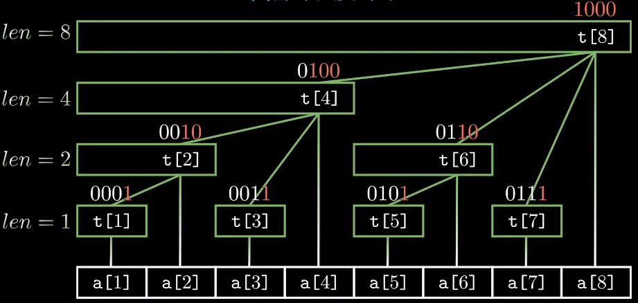
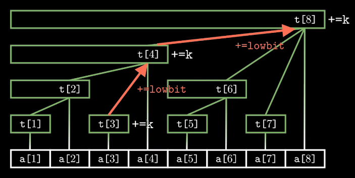
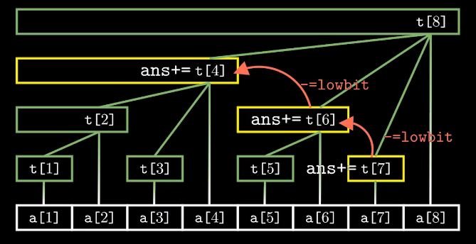

## 树状数组

树状数组的应用范围比较小，常见的用法主要是：

1. 快速的求取前缀和 => O(logn)

2. 修改某一个数 => O(logn)

树状数组的本质使用树的形式维护一个前缀和，建立一个如下的树形结构



其有以下的性质：

1. 每个节点t[x]保存以x为根的子树的节点值得和

2. 每个节点覆盖的长度为lowbit(x)

3. t[x]的父节点是t[x + lowbit(x)]

4. 树的深度是log(n) + 1

其具有两个操作，一个是`add(x,k)`给序列中第x个数加上k

```
void add(int x, int k)
{
    for(int i = x; i <= n; i += lowbit(i))
        t[i] += k;
}
```



另外一个操作是`ask(x)`求出序列前x个数的和

```
int ask(int x)
{
    int sum = 0;
    for(int i = x; i; i -= lowbit(i))
        sum += t[i];
    return sum;
}
```
