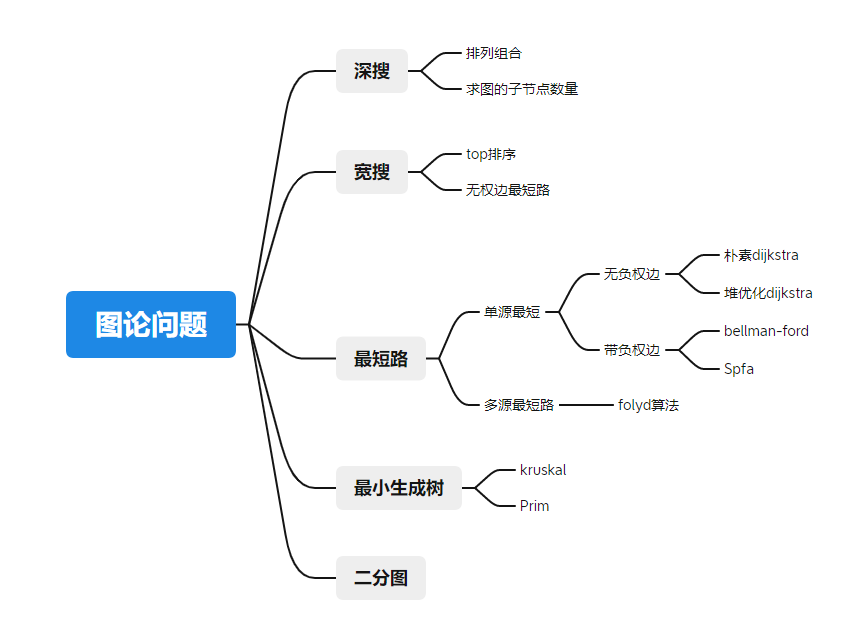

## 图论问题




### 图的创建

稠密图一般用邻接矩阵，稀疏图用邻接表。

```
int h[N],e[N],ne[N],w[N],idx;
memset(h,-1,sizeof h);
void add(int a,int b,int c){
	e[idx] = b,ne[idx] = h[a],h[a]=idx++,w[i]=c;
}

for(int i = h[node];i != -1;i = ne[i]){
	int cur_node = e[i];
	//...
}
```

### 深搜和宽搜

深搜的经典步骤就是回溯

宽搜可以处理的一个经典问题就是topsort，入度和出度的问题。还有一个就是无权等值边图的最短路问题。

### 最短路问题


